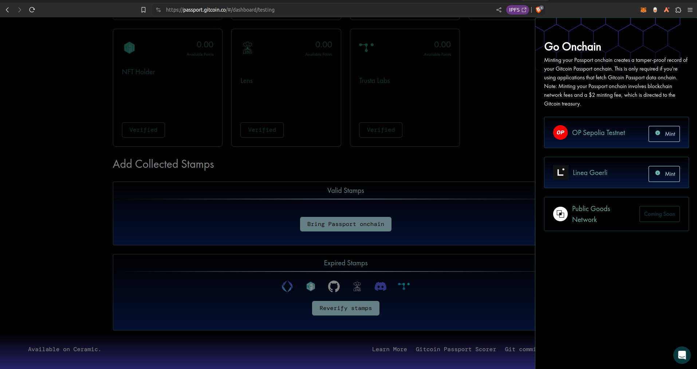

# Testing Onchain Passport

As developers, we often want to test our apps and integrations on testnets, where there is nothing of real world value at stake, before we go live on a live public mainnet. You can always deploy the Gitcoin Passport smart contracts to your own local ephemeral blockchain, but it is also recommended to test your integration on a public testnet too, as this more realistically simulates a mainnet environment.

For this reason, the Passport team deployed the Passport smart contracts on public testnets, including OP Sepolia and Linea Goerli.

## Test mode in the Passport app

The Passport app can be run in test mode by visitng URL and following the steps below:

https://passport.gitcoin.co/#/testing/dashboard

This enables you to write Passport data and scores to the Gitcoin Passport smart contracts on several testnets, meaning you can experiment and get comfortable with the flows before trying it out on Mainnet. 

When you sign in to the Passport app, you first have to enable Test Mode. There is a button for this at the top of the page. Enabling Test Mode requires an additional signature from your Ethereum account.
 
Once Test Mode is enabled, you can click on `Bring Passport onchain` towards the bottom of the Passport app to view the supported testnets in a panel that pops out from the right-hand side of the page. The app switches over to whichever network you select by clicking on the preferred network in the panel in the app's UI.

Other than the network selection panel, the behavior of the test app is identical to the real, "live" Passport app.

## Test mode for developers

Test mode also gives developers the ability to read and write to Passport smart contracts and also develop and test Passport integrations into their own smart contracts. On test networks, this can be done without spending any real ETH on gas fees and without putting any assets at risk from exploits.

Since the Passport contracts are deployed on public testnets as can be used by anyone, there are proper Passport data and many integrations on these testnets that offer a much more realistic test environment than local, ephemeral blockchains and the Passport contracts are already deployed there and managed by the passport team, easing your development process.

To work in Test Mode, developers simply have to switch their development environments onto one of the supported test networks and use the appropriate contract addresses for that network.

## Which networks are supported?

The available test networks are:

- [Optimism Sepolia](https://sepolia-optimism.etherscan.io/)
- [Linea Goerli](https://docs.linea.build/)

## Testing on mainnet forks

The Gitcoin smart contracts may sometimes be upgraded after being deployed. If you are testing on a mainnet fork, you must make sure you fork the blockchain at a block *after* the latest contract deployment. Otherwise, the contracts stored in your forked blockchains state will be out of date. The block where the latest version of the contract is deployed is known as the `latest stable block` and you can find out what it is by looking at the contract deployment details on the appropriate block explorer for the network you want to fork. Then, fork the blockchain at a block greater to or equal to the `latest stable block`. 

For example, the latest stable block for OP mainnet is 115525426. Your test network must fork off OP mainnet at a block >= 115525426.
